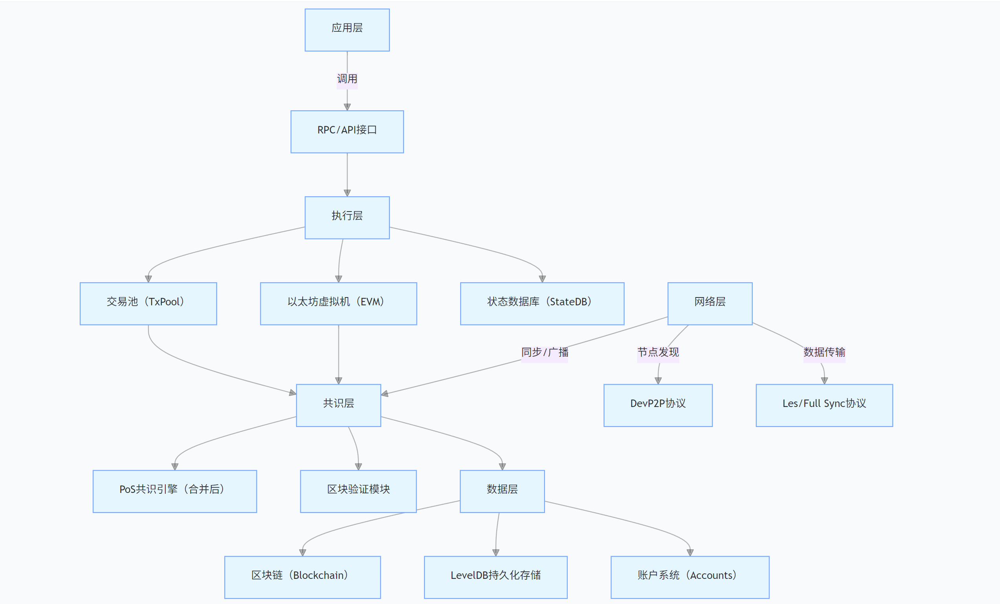
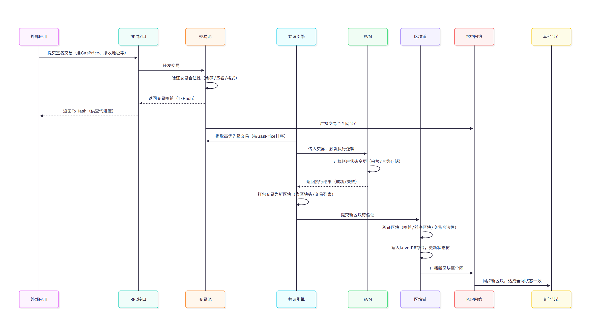

# Go-Ethereum（Geth）核心架构解析

## 一、核心架构概览

Go-Ethereum（Geth）采用模块化分层架构，从上到下分为 5 层：

- **应用层**：提供外部交互接口
- **执行层**：处理交易执行与状态管理
- **共识层**：确保全网数据一致性
- **网络层**：实现节点间通信与数据同步
- **数据层**：负责数据持久化存储

各层通过清晰的接口交互，实现功能解耦与独立扩展。

## 二、核心组件解析

| 组件                 | 所属层级 | 实现原理                                                    | 核心作用                                       |
| -------------------- | -------- | ----------------------------------------------------------- | ---------------------------------------------- |
| 区块链 (Blockchain)  | 数据层   | 链式结构存储区块，每个区块包含前序哈希，使用 LevelDB 持久化 | 管理区块全量数据，提供区块验证、存储和查询能力 |
| 交易池 (TxPool)      | 执行层   | 基于优先级队列 (按 GasPrice 排序)，过滤无效交易             | 暂存未上链合法交易，为区块打包提供交易来源     |
| 以太坊虚拟机 (EVM)   | 执行层   | 栈式虚拟机，支持 EVM 指令集，通过 StateDB 操作状态          | 执行智能合约和交易逻辑，计算账户状态变更       |
| 共识引擎 (Consensus) | 共识层   | 合并后采用 PoS 机制，通过验证者质押与投票达成共识           | 确保全网节点对区块的一致性认可                 |
| P2P 网络模块         | 网络层   | 基于 DevP2P 协议，包含节点发现和数据同步机制                | 实现节点发现、区块同步和交易广播               |
| 账户系统 (Accounts)  | 数据层   | 支持 EOA (外部账户) 和 CA (合约账户)，基于公钥加密          | 管理账户信息、私钥和权限控制                   |
| RPC 接口             | 应用层   | 提供 HTTP/RPC、Web3.js 等接口                               | 为外部应用提供与 Geth 交互的标准化入口         |

## 三、组件相互关系

1. 交易流程：外部应用通过 RPC 提交交易→TxPool 验证并暂存→共识引擎提取交易→EVM 执行→写入区块链→P2P 广播至全网
2. 数据同步：新节点通过 P2P 发现邻居→同步区块数据→共识层验证→区块链存储→更新账户状态

## 四、账户状态存储模型

Geth 采用**Merkle Patricia 树**（MPT）存储账户状态，具有以下特点：

- 账户状态包括余额、nonce、存储根和代码哈希
- 采用前缀树结构，支持高效的状态验证和更新
- 每个区块包含状态根哈希，确保状态一致性
- 使用 LevelDB 存储 MPT 节点，实现持久化
- 状态变更通过 StateDB 在内存中维护，提交区块时批量写入

## 五、功能架构图




## 六、交易生命周期流程图



```
sequenceDiagram
    participant 外部应用
    participant RPC接口
    participant 交易池
    participant 共识引擎
    participant EVM
    participant 区块链
    participant P2P网络

    外部应用->>RPC接口: 提交签名交易（含GasPrice、接收地址等）
    RPC接口->>交易池: 转发交易
    交易池->>交易池: 验证交易合法性（余额/签名/格式）
    交易池-->>RPC接口: 返回交易哈希（TxHash）
    RPC接口-->>外部应用: 返回TxHash（供查询进度）
    交易池->>P2P网络: 广播交易至全网节点
    共识引擎->>交易池: 提取高优先级交易（按GasPrice排序）
    共识引擎->>EVM: 传入交易，触发执行逻辑
    EVM->>EVM: 计算账户状态变更（余额/合约存储）
    EVM-->>共识引擎: 返回执行结果（成功/失败）
    共识引擎->>共识引擎: 打包交易为新区块（含区块头/交易列表）
    共识引擎->>区块链: 提交新区块待验证
    区块链->>区块链: 验证区块（哈希/前序区块/交易合法性）
    区块链->>区块链: 写入LevelDB存储，更新状态树
    区块链->>P2P网络: 广播新区块至全网
    P2P网络->>其他节点: 同步新区块，达成全网状态一致
```

## 七、总结

- Geth 采用分层架构，各模块职责清晰，通过接口实现松耦合
- 交易处理是核心流程，涉及交易池、EVM、共识引擎和区块链等组件
- 账户状态通过 Merkle Patricia 树维护，确保数据完整性和高效验证
- P2P 网络是实现去中心化的关键，负责节点发现和数据同步
- 共识引擎从 PoW 转为 PoS 后，提升了网络安全性和能源效率